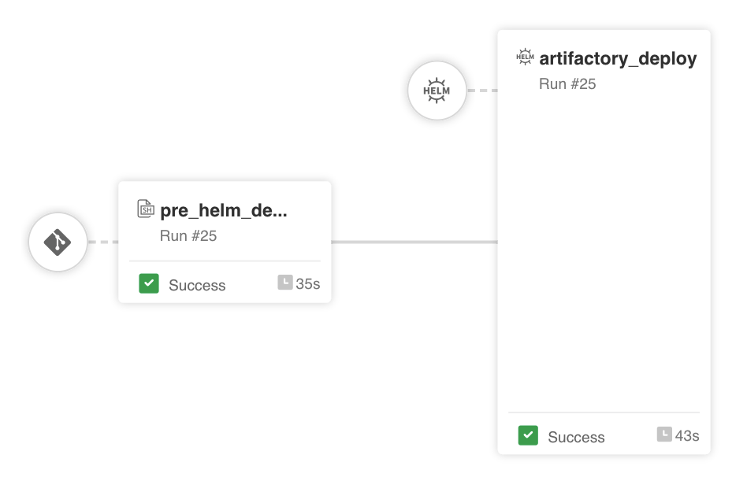

# jfrog-pipelines-jpd-helm
Sample of JFrog Pipeline to deploy an instance of the JFrog Platform using Helm charts

**Work in progress**

---

**Note: This is a sample pipeline implementation. The code available here is not supported or guaranteed to work. Use at your own risk.**

---

The purpose of this sample is to showcase JFrog Pipeline's' capabilities of deploying a set of Helm charts with custom configuration values, use of pipelines integrations and secrets.

The pipeline gets the JFrog helm chart from an Artifactory remote Helm repository, performs some pre-checks and configuration settings in a `pre-check` step (e.g. create Kubernetes namespace; automatically generate keys and passwords as Kubernetes secrets;  parse values and configuration files) and then deploys the helm chart using the [HelmDeploy](https://www.jfrog.com/confluence/display/JFROG/HelmDeploy) native step of JFrog Pipelines.

---

### How to setup the pipeline

1. Fork this git repo 

1. In Artifactory, [create an integration](https://www.jfrog.com/confluence/display/JFROG/GitHub+Integration) for the git repository created in the previous step. 

1. In Artifactory, create a [Helm remote repository](https://www.jfrog.com/confluence/display/JFROG/Kubernetes+Helm+Chart+Repositories#KubernetesHelmChartRepositories-RemoteRepositories) that proxies requests to `https://charts.jfrog.io` 

1. In Artifactory, create an [integration for the artifactory server](https://www.jfrog.com/confluence/display/JFROG/Artifactory+Integration) containing the helm repo configured in the previous step.

1. In Artifactory, create a [Kubernetes integration](https://www.jfrog.com/confluence/display/JFROG/Kubernetes+Integration) entry for the targeted Kubernetes cluster

1. In Artifactory, create a [PEM integration](https://www.jfrog.com/confluence/display/JFROG/PEM+Key+Integration) entry with the JFrog license key in it.

1. Upddate `values.yml` with your own values, see inline comments in the file for guidance. 

1. Add your git repo from (1) as a [pipeline source](https://www.jfrog.com/confluence/display/JFROG/Pipelines+Step-By-Step#PipelinesStep-By-Step-add-pipeline-sourceAddaPipelineSource) to your JFrog Platform.

1. Once the new pipeline source is successfully resolved, go to "Pipelines > My Pipelines" in Artifactory and click on your pipeline's name, which is ready to be executed.

---

### References

- [JFrog Documentation - Installing the JFrog Platform Using Helm Chart](https://www.jfrog.com/confluence/display/JFROG/Installing+the+JFrog+Platform+Using+Helm+Chart)

- [JFrog Documentation - Helm Charts for Advanced Users](https://www.jfrog.com/confluence/display/JFROG/Helm+Charts+for+Advanced+Users)

- [JFrog Helm Charts - official git repository](https://github.com/jfrog/charts)

---